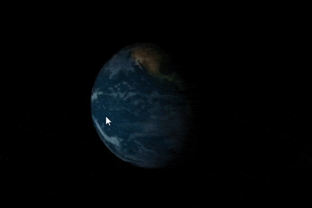

# P10. Vertex Shaders

### Autor: Jonay Suárez Ramírez

## Descripción

En este proyecto se ha desarrollado un shader generativo de glsl que intenta asimilarse a la famosa intro de UNIVERSAL Pictures.

Para ello se han desarrollado dos Shaders ( `lightfrag.glsl` y `lightvert.glsl` ), uno de vértices y otro de fragmentos. Ambos son shaders de textura e iluminación.

Moviendo el ratón se puede mover la fuente de luz que interactura con la esfera y el texto 3D generado usando la librería geomerative (Código adaptado de https://discourse.processing.org/t/3d-text-library/21776/2).

## Controles
- El ratón tanto en X como en Y.

## Referencias y Herramientas

1. Tutorial Shaders proccesing. Colubri, A. https://processing.org/tutorials/pshader/.

2. Guión de prácticas de CIU.

3. Documentación online de glsl.

4. Crear GIF animado: https://www.online-convert.com/es.

## Resultado

